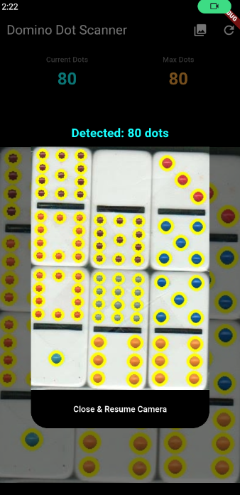

<div align="center">

# 🁣 Ry Dots

**Real-time domino dot detection for Android, powered by OpenCV**

[](https://flutter.dev)
[](https://opencv.org)
[](https://developer.android.com)
[](LICENSE)

<br/>



<br/>
<br/>

> Point your camera at a domino tile and instantly see every dot detected, highlighted, and counted in real time.

</div>

---

## 📖 Overview

**Domino Dots** is an Android application built with Flutter that uses computer vision to detect and count the dots (pips) on domino tiles. The app processes the live camera feed frame-by-frame using OpenCV, applying color masking and blob detection to accurately identify and highlight each dot in real time.

It also supports testing with static images from your gallery — making it easy to validate and tune the detection algorithm without needing a physical domino.

---

## ✨ Features

- 🎥 **Live camera detection** — processes the camera feed in real time, frame by frame
- 🖼️ **Gallery image testing** — pick any image from your device to test the algorithm
- 🔵 **Visual dot highlighting** — detected dots are circled directly on the frame
- 🔢 **Live dot counter** — shows the current number of detected dots on screen
- 📈 **Max dot tracker** — tracks the highest dot count seen in a session
- 🔄 **Reset button** — resets the max counter for a fresh session
- ⚡ **Async processing** — non-blocking frame pipeline keeps the UI smooth

---

## 🛠️ Tech Stack

| Layer | Technology |
|---|---|
| Framework | [Flutter](https://flutter.dev) 3.35.7 |
| Language | Dart |
| Computer Vision | [opencv_dart](https://pub.dev/packages/opencv_dart) v1.4.5 |
| Camera Access | [camera](https://pub.dev/packages/camera) |
| Image Processing | [image](https://pub.dev/packages/image) |
| Gallery Picker | [image_picker](https://pub.dev/packages/image_picker) |
| Min Android SDK | API 21 (Android 5.0) |

---

## 🧠 How It Works

The detection pipeline is a direct Dart port of an OpenCV Python script:

```
Camera Frame (YUV420)
        │
        ▼
  Convert to JPEG
        │
        ▼
  Decode to cv.Mat
        │
        ▼
  Convert BGR → HSV
        │
        ▼
  Create Yellow Mask         ← isolates the domino tile background
  (HSV range [15–35, 100–255, 100–255])
        │
        ▼
  Invert Mask                ← keeps only non-yellow areas (the dots)
        │
        ▼
  Apply Mask to Frame
        │
        ▼
  SimpleBlobDetector         ← finds circular dark blobs (the dots)
  (area: 50–5000px, circularity ≥ 0.8,
   convexity ≥ 0.9, inertia ≥ 0.9)
        │
        ▼
  Draw Circles + Count
        │
        ▼
  Display on Screen
```

### Python → Dart Mapping

| Python (OpenCV) | Dart (opencv_dart) |
|---|---|
| `cv2.VideoCapture` | `CameraController` + `startImageStream()` |
| `cv2.cvtColor` | `cv.cvtColorAsync()` |
| `cv2.inRange` | `cv.inRangeAsync()` |
| `cv2.bitwise_not` | `cv.bitwiseNOTAsync()` |
| `cv2.bitwise_and` | `cv.bitwiseANDAsync()` |
| `SimpleBlobDetector` | `cv.SimpleBlobDetector.create()` |
| `cv2.circle` | `cv.circle()` |
| `cv2.imshow` | `Image.memory()` widget |

---

## 🚀 Getting Started

### Prerequisites

- [Flutter SDK](https://flutter.dev/docs/get-started/install) 3.x
- Android Studio or VS Code with Flutter extension
- Android device or emulator (API 21+)

### Installation

**1. Clone the repository**
```bash
git clone https://github.com/Ryan-PG/domino_dot_detector
cd domino_dot_detector
```

**2. Install dependencies**
```bash
flutter pub get
```

**3. Run the app**
```bash
flutter run
```

> ⚠️ The first build will take several minutes. The `opencv_dart` package downloads and compiles the OpenCV native SDK (~100MB) via CMake. This is cached after the first build.

---

## 📁 Project Structure

```
lib/
├── main.dart                          # App entry point, camera init
├── screens/
│   └── domino_scanner_screen.dart     # Main UI, camera stream, gallery picker
└── services/
    └── dot_detector.dart              # OpenCV processing pipeline
```

---

## 📱 Usage

### Live Camera Mode
Simply open the app and point the camera at a domino tile. Detected dots will be circled in **cyan** and the count is shown at the top of the screen.

### Gallery / Test Mode
Tap the **🖼️ gallery icon** in the top-right corner, select an image from your device, and the app will process it using the same detection pipeline. Results are shown in a dialog overlay.

### Controls

| Button | Action |
|---|---|
| 🖼️ Photo Library | Pick an image from gallery to test |
| 🔄 Refresh | Reset the max dot counter |

---

## ⚙️ Configuration & Tuning

The blob detector parameters in `dot_detector.dart` can be adjusted to suit different domino styles or lighting conditions:

```dart
params.minArea = 50;           // minimum dot size in pixels
params.maxArea = 5000;         // maximum dot size in pixels
params.minCircularity = 0.8;   // how round the blob must be (0–1)
params.minConvexity = 0.9;     // how convex the blob must be (0–1)
params.minInertiaRatio = 0.9;  // how elongated it can be (1 = perfect circle)
```

The yellow HSV mask range can also be adjusted in `dot_detector.dart`:

```dart
final lowerYellow = cv.Mat.fromScalar(1, 1, cv.MatType.CV_8UC3, cv.Scalar(15, 100, 100));
final upperYellow = cv.Mat.fromScalar(1, 1, cv.MatType.CV_8UC3, cv.Scalar(35, 255, 255));
```

If your domino tiles have a different background color, adjust these HSV values accordingly.

---

## 🐛 Known Issues & Notes

- **Emulator performance** — YUV→JPEG conversion is CPU-intensive. Use `ResolutionPreset.low` on emulators for smoother performance.
- **Lighting sensitivity** — detection works best in good, even lighting. Shadows over dots may reduce accuracy.
- **Yellow tile assumption** — the algorithm is tuned for yellow-background dominoes. White or other colored tiles may require HSV range adjustments.

---

## 🙏 Acknowledgements

This project would not exist without the original idea and work of **[@itsCharlesAM](https://github.com/itsCharlesAM)**.

He wrote the original Python + OpenCV script that this Flutter app is based on, and it was his idea to bring this detection algorithm to Android. Big thanks to him for the inspiration and the foundation that made this project possible. 🎉

---

## 📄 License

This project is licensed under the MIT License. See the [LICENSE](LICENSE) file for details.

---

<div align="center">

Made with ❤️ and Flutter

</div>
